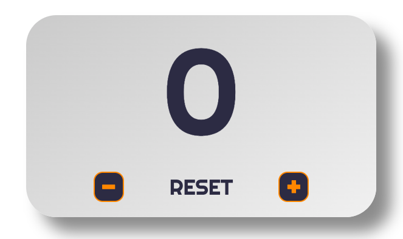

# Counter 

---

- Descrizione grafica. 
- Descrizione del codice.
- Utilizzo. 
- Link al sito.

---

### La grafica del counter 

Ho deciso di realizzare un counter il più smart e pulito possibile, i colori sono estramamente ridotti per non creare particolari distrazioni ed il posizionamento di ogni elemento segue delle regole semplici dirette al renderlo di facile comprensione ed utilizzo. 

---

### Il codice 

Per il codice ho seguito più o meno le stesse regole prefissatemi nella scelta stilistica, ho cercato di rendere il codice pulito, chiaro e facilmente fruibile riducendo al minimo gli elementi nel file `index.html`, mentre nel file `counter.js` ho prestato attenzione al suddividere con chiarezza varibili, funzioni ed i vari richiami alle funzioni scritte in precedenza. 

--- 

### Utilizzo 

Il risultato di questa scelta stilistica e di scrittura di codice è un counter che non ha assolutamente bisogno di essere spiegato, ogni elemto ricopre la sua ovvia funzione ed è facile comprenderlo fin dal primo colpo d'occhio.
Nello specifico:
- il tasto "-" diminuisce di uno il numero riportato nel counter 
- il tasto "reset" riporta il numero del counter a 0 
- il tasto "+" aumenta di uno il numero riportato nel counter 

---

[link](https://cenosillicaphobia.github.io/Javascript-Counter/)

